# How to use Retrieval Augmented Generation with WatsonX

Hello everyone, today we are going to ask questions to **WatsonX** by using a custom set of data by using the **Retrieval Augmented Generation (RAG)**

The **Retrieval Augmented Generation**  is one of the most common use cases by using foundation models.  Essentially question answering.

So the problem is the following: You have a set of documents and you wat answer documents based on data that is contained in this document.

Let us a concrete example, yo have a **Documentation** of an specific product of your **Business** and you want  answer queries from your employees, and you want to provide an answer only using the data that is present in **Documentation.**

If your employee makes a question that is not contained in the **Documentation** the answer will obtained from the **Foundation model** but generated by the Documentation. The **foundation model** itself would not have been trained using the data for is there in **Documentation**.

## Introduction  

**How do you make it generate a response when it has not been trained on it?** 

That is what Retrieval Augmented Generation does. Its a three step process:

1. Generate Embedding for each document and store it in Vector Database. In  this step our documents are sent to an Embedding model which generates an embedding out of it , an embedding is kind of array of numbers, this embedding is stored in a Vector Database.

2. Find the documents most similar to user question using Vector Database. Answer to user question is very likely to be present in the top-k documents.

   We send  the user questions to the embedding model to generate an embedding for it, and this embedding user question is sent to the vecrtor database and  is used to find the top-k documents  which is more similar to the user question, ie closest to embedding user question in the Vector Database, and then is answer which documents are relevant. We generate an answer using foundation model and give it back to the user.

3. The last step is where foundation models play a role. Take top-3 documents returned by Vector database and ask Foundation Model to come up with answer to the user question using only the text of the three documents. Here the user question is used to construct a prompt that are questions to be asked to the foundation model and then you get the answer.

Let us create our notebook environment and create make some questions from a sample documents.

## Step 1: Install and Run Jupyter Lab locally

First we need to install python in our computer , in this demo I  will use Python **3.10.11**

[https://www.python.org/ftp/python/3.10.11/python-3.10.11-amd64.exe](https://www.python.org/ftp/python/3.10.11/python-3.10.11-amd64.exe)

During the installation I should suggest add **python.exe to PATH** and **install Now**

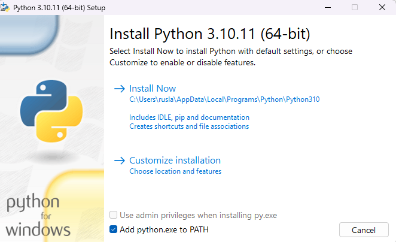


With Python already installed, you should have pip already installed. Be sure to use a pip that corresponds with Python 3 by using pip3 or checking your pip executable with "pip --version".

## Step 2: Create a Python virtual environment

A Python virtual environment allows one to use different versions of Python as well as isolate dependencies between projects. If you've never had several repos on your machine at once, you may never have felt this need but it's a good, Pythonic choice nonetheless. Future you will thank us both!

 Let us create a folder called gpt  and there we will  store our  virtual environment. 

```
mkdir gpt
cd gpt
```

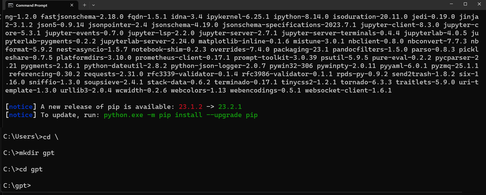

Supposed that you have a different version of Python installed in your system. To check use the following command to check:

```
py --list
```

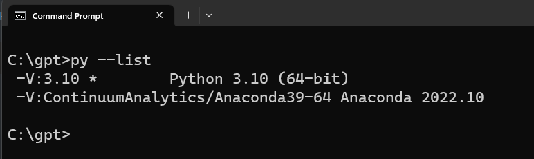


And you want to create a new virtual environment for python 3.10 on a 'test_env' directory. Run the following command:

```py
 py -3.10 -m venv my_venv
```

You'll notice a new directory in your current working directory with the same name as your virtual environment.

Activate the virtual environment.

Windows: 

```
my_venv\Scripts\activate.bat
```

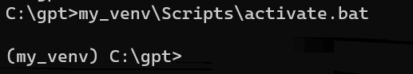

All other OSs: source 

```
./my_venv/bin/activate
```

When the virtual environment is activated, your command prompt should change in some way, indicating the name of the virtual environment. This is how you'll know it's active. You can further verify this by executing "which pip" or "which python" to see that both binaries are located inside you virtual environment directory.

A virtual environment is only activate in your current terminal session. There is no need to deactivate it before closing your terminal.

However, if you need to deactivate it you can do so by executing "deactivate", a script that only exists when a virtual environment is activated.

Note: Be sure to deactivate a virtual environment before deleting its directory.

### Step 3: Create a Jupyter Kernel from Inside your Virtual Environment

 We are goigng to install **Jupyter Lab.**

Let us open our command prompt and type

```
python.exe -m pip install --upgrade pip
```

```
pip install jupyterlab
```

For more information visit the official [Jupyter Lab](https://jupyterlab.readthedocs.io/en/stable/getting_started/installation.html#pip) site.

A Jupyter "kernel" is simply a reference to a particular Python interpreter instance. You can create a kernel from any Python interpreter on your machine, including those inside of virtual environments and then choose it as your kernel for any notebook. In this way, you can customize the environments of different notebooks benefiting from the same isolation virtual environments offer during normal development.

Once we are in our environment we proceed to install ipykernel

```
pip install ipykernel
```

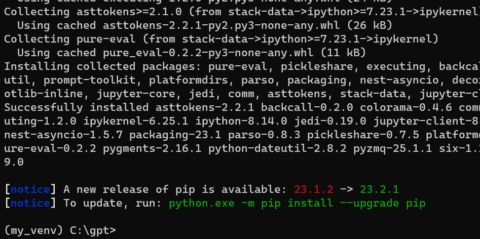

then

```
python -m ipykernel install --user --name gpt --display-name "Python3 (GPT)"
```

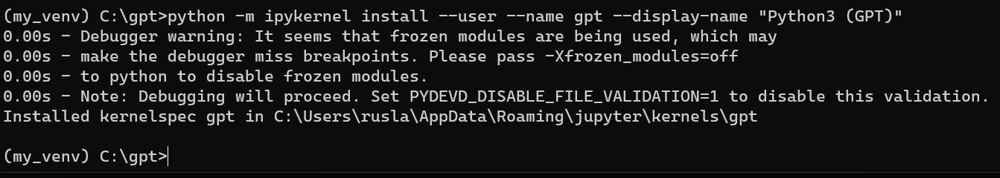

With your virtual environment created and the ability to run a Jupyter Notebook in that environment.


## Install and import the dependecies


You can copy the following code block and paste it on your terminal where you are in your enviroment.

```
pip install datasets 
pip install scikit-learn 
pip install chromadb==0.3.27 
pip install sentence_transformers
pip install pandas 
pip install rouge_score 
pip install nltk 
pip install "ibm-watson-machine-learning>=1.0.312" 
pip install ipywidgets widgetsnbextension pandas-profiling

```
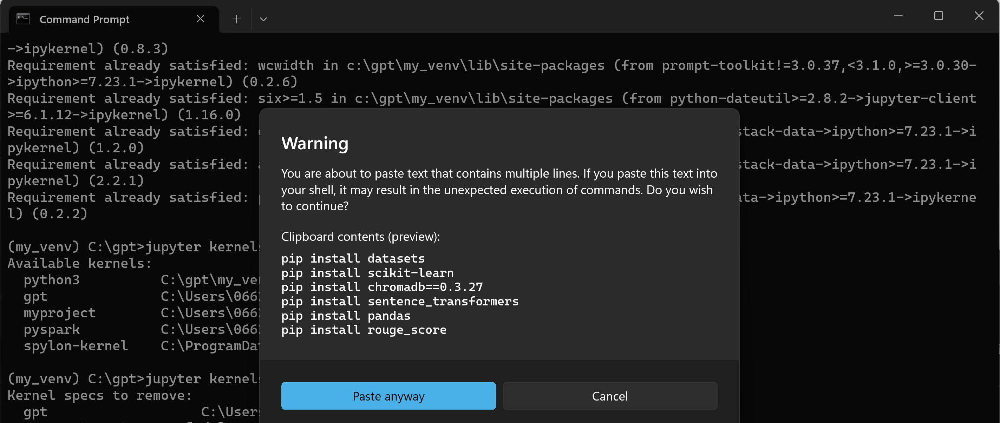

If we are in Linux we can add the followig condition after each line `| tail -n 1` to surpress logs. 


Before run the notebook, we require load our IBM cloud services.


# Step 5 - Login to IBM cloud

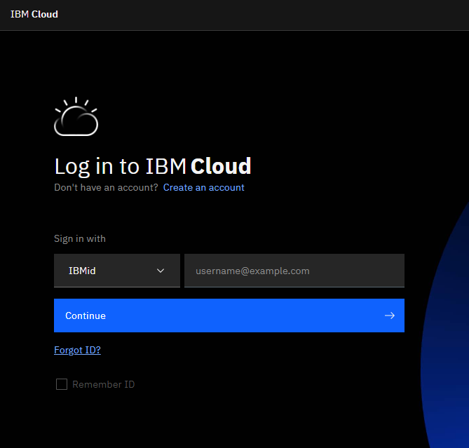

after you have logged, create a WatsonX instance

[https://www.ibm.com/watsonx](https://www.ibm.com/watsonx)

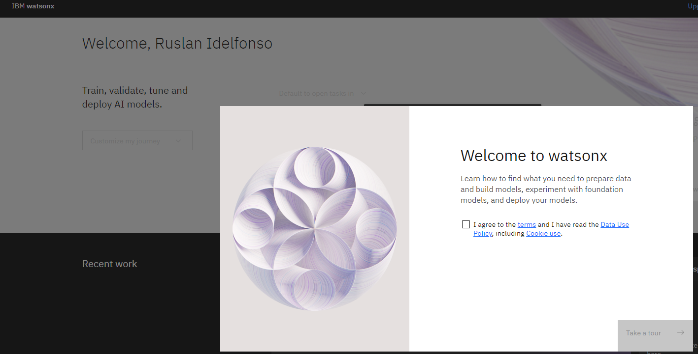

Then open a simple Prompt Lab

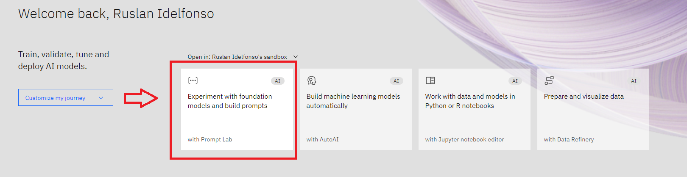


Then click  **View Code** and then  click  on  **Create personal API key**

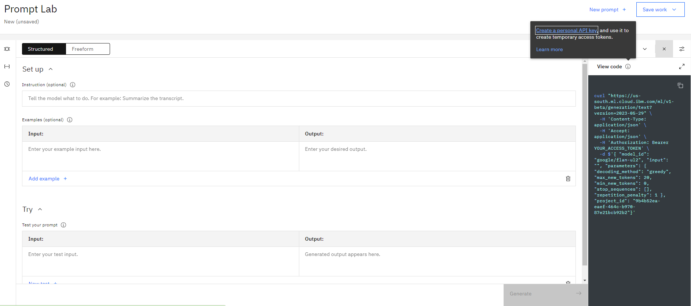

then we create our custom GPT API, I call it gpt and I give an small description


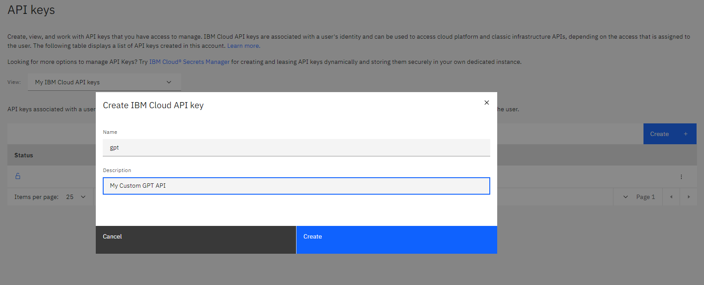

I copy the API key for future use

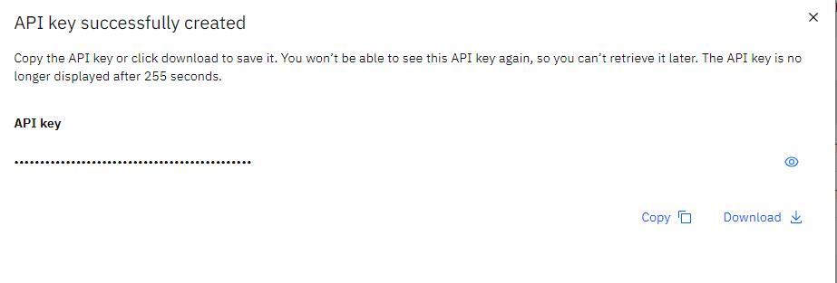


## Loading Evaluation Notebook.

In this part we are going to download the notebook where we are going to build our models.

 We can open our jupyter lab by typing

```
jupyter lab
```

and we create a new Notebook **Python3 (GPT)**

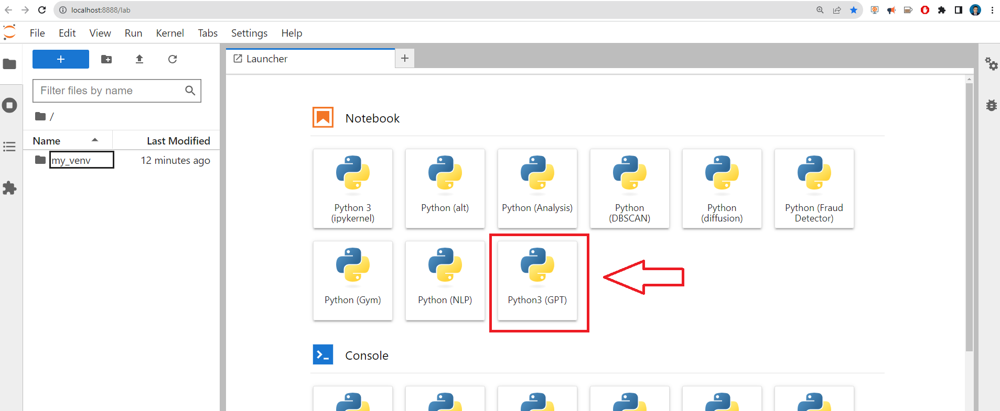


or in the notebook open the "Kernel" menu and select "Change Kernel..."


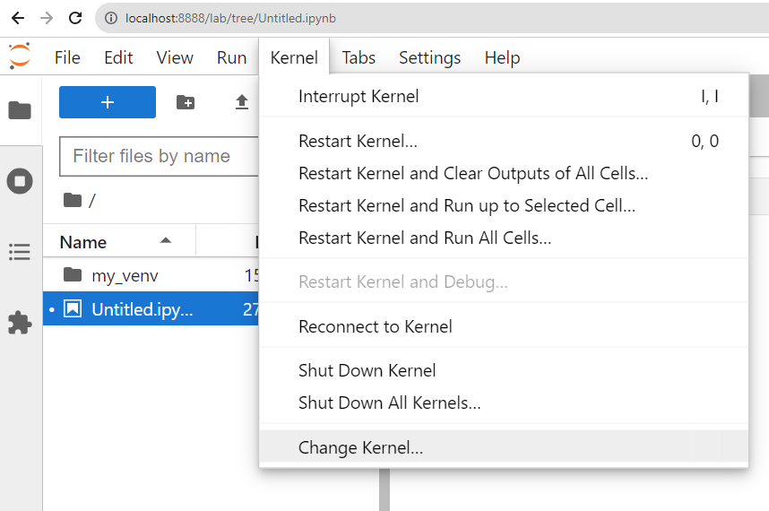

If the kernel tab is all greyed out, just start a python 3 notebook from the launcher.  The kernel list should then have selectable items.


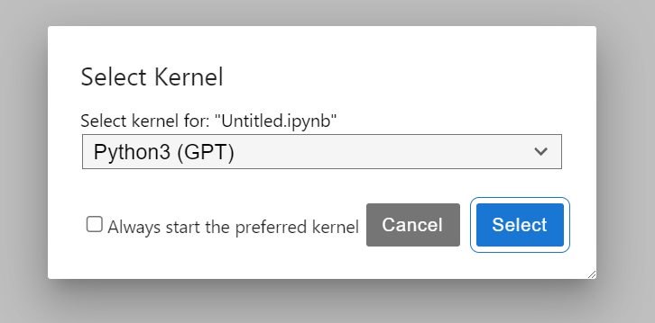

and you will have somehing like
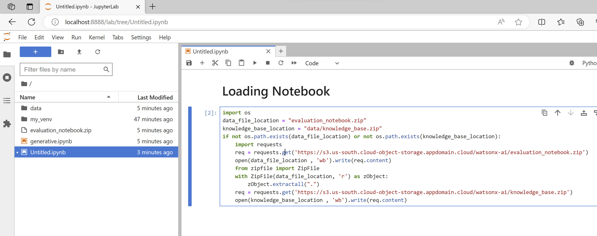


```
import os
data_file_location = "evaluation_notebook.zip"
knowledge_base_location = "data/knowledge_base.zip"
if not os.path.exists(data_file_location) or not os.path.exists(knowledge_base_location):
    import requests
    req = requests.get('https://s3.us-south.cloud-object-storage.appdomain.cloud/watsonx-ai/evaluation_notebook.zip')
    open(data_file_location , 'wb').write(req.content)
    from zipfile import ZipFile
    with ZipFile(data_file_location, 'r') as zObject:
        zObject.extractall(".")
    req = requests.get('https://s3.us-south.cloud-object-storage.appdomain.cloud/watsonx-ai/knowledge_base.zip')
    open(knowledge_base_location , 'wb').write(req.content)
```

# Evaluation of the Notebook

Now open the `generative.ipynb` file in Jupyter Lab

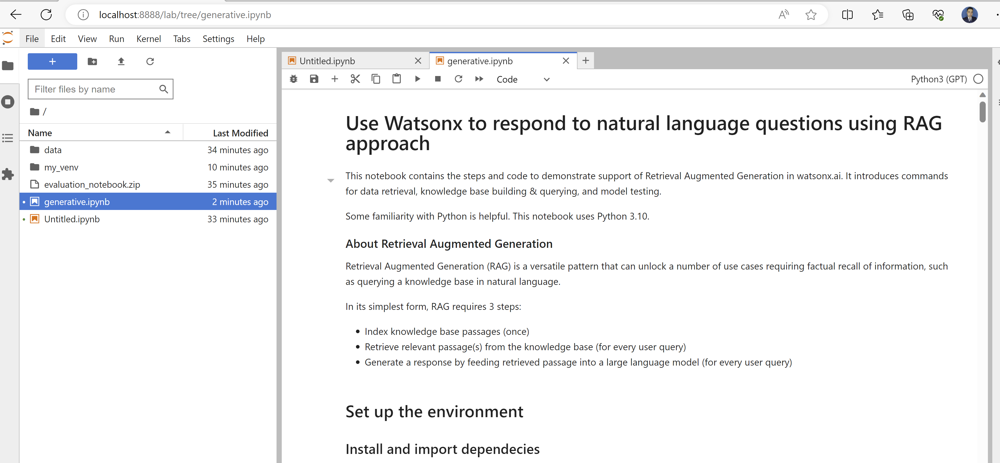

# Troubleshooting's

The notebooks where developed under Python 3.10 if we are python 3.11 we cab use `pip install chromadb==0.4.4 `for python 3.11 but you have to perform some extra modifications in your notebook for this project.

### Remove kernels installed
If you have issues to the installation of the kernel you can remove the kernel and try again.


To list the kernels currently installed execute 

```
jupyter kernelspec list
```

To remove a kernel execute 

```
jupyter kernelspec remove gpt
```


### Missing packages
In case the missing package error occurs, it can be installed by adding code cell in the notebook with command:
```cmd
!pip install missing_package_name
```

**Note:** the kernel restart may be required.

 ## Load credentials with Bearer
```python
 #this cell should never fail, and will produce no output
import requests

def getBearer(apikey):
    form = {'apikey': apikey, 'grant_type': "urn:ibm:params:oauth:grant-type:apikey"}
    print("About to create bearer")
#    print(form)
    response = requests.post("https://iam.cloud.ibm.com/oidc/token", data = form)
    if response.status_code != 200:
        print("Bad response code retrieving token")
        raise Exception("Failed to get token, invalid status")
    json = response.json()
    if not json:
        print("Invalid/no JSON retrieving token")
        raise Exception("Failed to get token, invalid response")
    print("Bearer retrieved")
    return json.get("access_token")
credentials["token"] =""
getBearer(credentials["apikey"])
```

### Use of podeman in Mac 

```
brew install podman
podman machine init --cpus=6 --memory=8192 -v $HOME:$HOME wx
podman machine start wx
```

### Dockerfile

```dockerfile
## It handles also issues with rustc Compiler various Python libs need in Challenge 3
FROM jupyter/datascience-notebook
RUN curl https://sh.rustup.rs -sSf | sh -s -- -y
ENV PATH="${HOME}/.cargo/bin:${PATH}"
RUN rustc --version

# build the docker file
podman build -t "wx" .

# start the container in putting the following lines into a shellscript startwx.sh
export uid=1000
export gid=100
export subuidSize=$(( $(podman info --format "{{ range .Host.IDMappings.UIDMap }}+{{.Size }}{{end }}" ) - 1 ))
export subgidSize=$(( $(podman info --format "{{ range .Host.IDMappings.GIDMap }}+{{.Size }}{{end }}" ) - 1 ))
podman run -it --rm -p 8888:8888 \
    -v "${PWD}":/home/jovyan/work --user $uid:$gid \
    -e "JUPYTER_ENABLE_LAB=yes" -e "JUPYTER_TOKEN=watsonx" \
    --uidmap $uid:0:1 --uidmap 0:1:$uid --uidmap $(($uid+1)):$(($uid+1)):$(($subuidSize-$uid)) \
    --gidmap $gid:0:1 --gidmap 0:1:$gid --gidmap $(($gid+1)):$(($gid+1)):$(($subgidSize-$gid)) \
    wx
# start the script and open the browser http://127.0.0.1:8888/
```

 